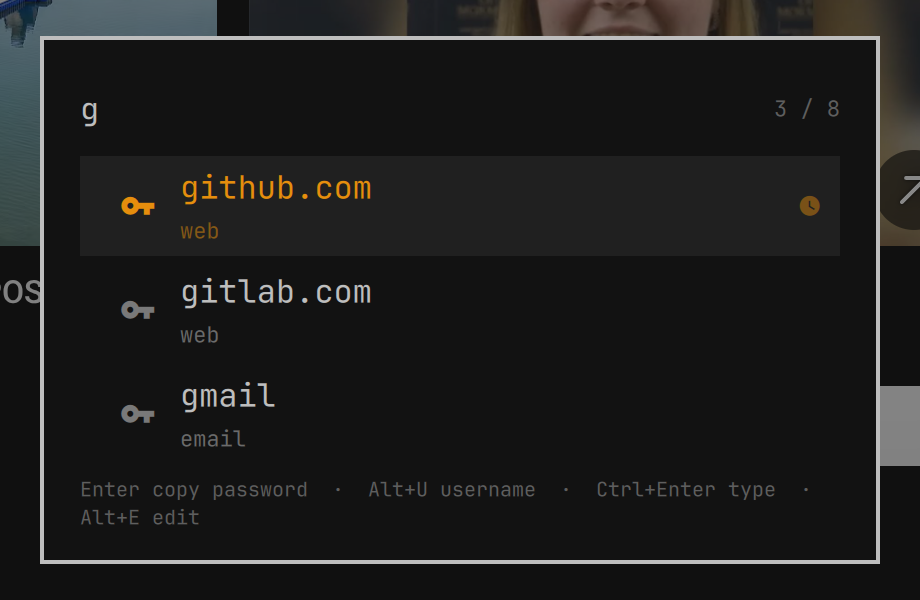

# Password Store for Omarchy

[pass](https://www.passwordstore.org/), the standard unix password manager, in
the [Omarchy](https://omarchy.org/) bar.



- A key on the bar. Click it (or `omarchy-shell shell toggle hegjon.passwordstore`
  from a keybinding) and type to search your store; `ghb` finds
  `web/github.com`.
- `Enter` copies the password, `Alt+U` the username, `Alt+O` a fresh OTP code
  (with [pass-otp](https://github.com/tadfisher/pass-otp)). `Ctrl+Enter` types
  the password into the window you came from, `Ctrl+Shift+Enter` the username.
  `Alt+E` opens the entry in a terminal with `pass edit`.
- Recently used entries float to the top of an empty search.
- Nothing is decrypted by the widget. Every action is handed to `pass` itself,
  so gpg-agent prompts as it would from a terminal and the clipboard is
  cleared after 45 s exactly as `pass -c` does.

## Install

```bash
git clone https://github.com/hegjon/omarchy-passwordstore \
  ~/.config/omarchy/plugins/hegjon.passwordstore
omarchy bar put hegjon.passwordstore
```

The shell picks up the new plugin without a restart. If it does not, run
`omarchy restart shell`.

Needs `pass` (`omarchy pkg add pass`), `wl-clipboard` and `jq` (both part of
Omarchy), and `wtype` for the typing actions. `pass-otp` is optional; the OTP
action only appears when it is installed.

A keybinding is the natural way to reach it. In `~/.config/hypr/bindings.lua`
(`SUPER+P` is Omarchy's pseudo-window toggle by default, hence the unbind):

```lua
hl.unbind("SUPER + P")
o.bind("SUPER + P", "Password store", "omarchy-shell shell toggle hegjon.passwordstore")
```

`omarchy bar put` is still needed even if you only ever use the keybinding:
the bar entry is where the settings live.

## Keys

| Key                      | Action                                                   |
|--------------------------|----------------------------------------------------------|
| any printable            | Extend the search. `Backspace`, `Ctrl+Backspace`, `Ctrl+U` edit it |
| `↑` `↓` `Ctrl+J/K/N/P`   | Move the cursor; `PageUp/Down`, `Home`, `End` jump       |
| `Enter`                  | Copy the password (`pass show -c`)                       |
| `Alt+U` / `Alt+Enter`    | Copy the username                                        |
| `Alt+O`                  | Copy an OTP code (`pass otp -c`)                         |
| `Ctrl+Enter`             | Type the password into the focused window                |
| `Ctrl+Shift+Enter`       | Type the username                                        |
| `Alt+E`                  | `pass edit` in a terminal                                |
| `F5`                     | Re-read the store (it is also re-read every time it opens) |
| `Esc`                    | Clear the search, then close                             |
| mouse                    | Left click copies the password, right click the username, middle click an OTP |

The username is the value of the first `login:` / `user:` / `username:` /
`email:` line of the entry (configurable), or failing that the bare second
line, which is where pass's conventions put it.

## Settings

Change them from the bar's widget settings, or with `omarchy bar set`:

```bash
omarchy bar set hegjon.passwordstore storeDir ~/.password-store-work
omarchy bar set hegjon.passwordstore clipTimeSec 30
omarchy bar set hegjon.passwordstore allowTyping false --json
```

| Key              | Default                      | Meaning                                                                 |
|------------------|------------------------------|-------------------------------------------------------------------------|
| `storeDir`       | *(empty)*                    | Store location. Empty means `$PASSWORD_STORE_DIR` or `~/.password-store`, as pass does. |
| `clipTimeSec`    | `45`                         | Seconds until the clipboard is cleared (`PASSWORD_STORE_CLIP_TIME`).   |
| `usernameKeys`   | `login,user,username,email`  | Field names that hold the username, matched case-insensitively.        |
| `allowTyping`    | `true`                       | Enable `Ctrl+Enter` / `Ctrl+Shift+Enter` (needs `wtype`).               |
| `notifyOnCopy`   | `true`                       | Notify when something was copied. Failures are always notified.         |

## How it works

The plugin has two parts: an `overlay` (`PasswordstoreOverlay.qml`, the card,
summoned with `omarchy-shell shell toggle hegjon.passwordstore`) and a
`bar-widget` (`PasswordstoreWidget.qml`, the key on the bar, which also holds
the settings). Two small scripts do the work, and both can be run by hand:

- `passwordstore-list [--store DIR] [--recent FILE]` prints the names of the
  `*.gpg` files in the store as JSON. It never decrypts anything.
- `passwordstore-action <action> <entry> [...]` runs one action: `copy-password`,
  `copy-username`, `copy-otp`, `type-password`, `type-username` or `edit`.
  Secrets travel over pipes, never argv, and the popup has already closed when
  it runs, so a typed password lands in the window you were in.

Recently used names are kept in `$XDG_STATE_HOME/omarchy-passwordstore/recent`
(`~/.local/state/…`), outside the store so they are never committed with it.

## Development

`test/lint` runs qmllint, `test/test-manifest` checks the manifest,
`test/test-list` and `test/test-action` exercise the scripts against a
throwaway store and stand-in `pass`/`wl-copy`/`wtype`, so no gpg key is needed.

## License

MIT
